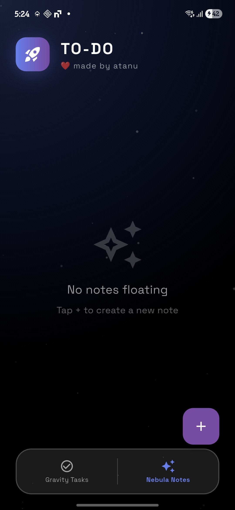
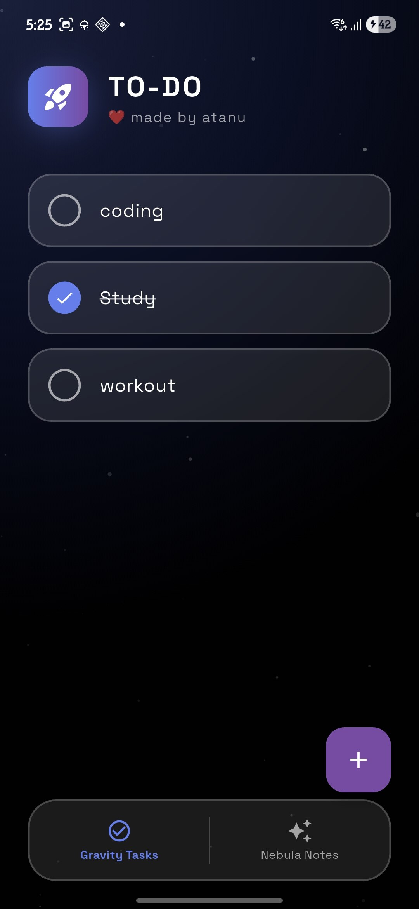
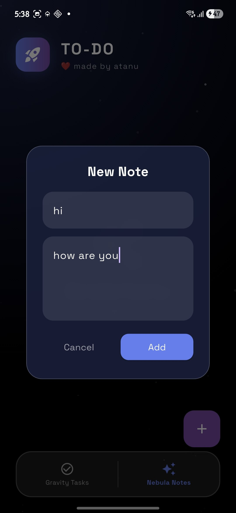
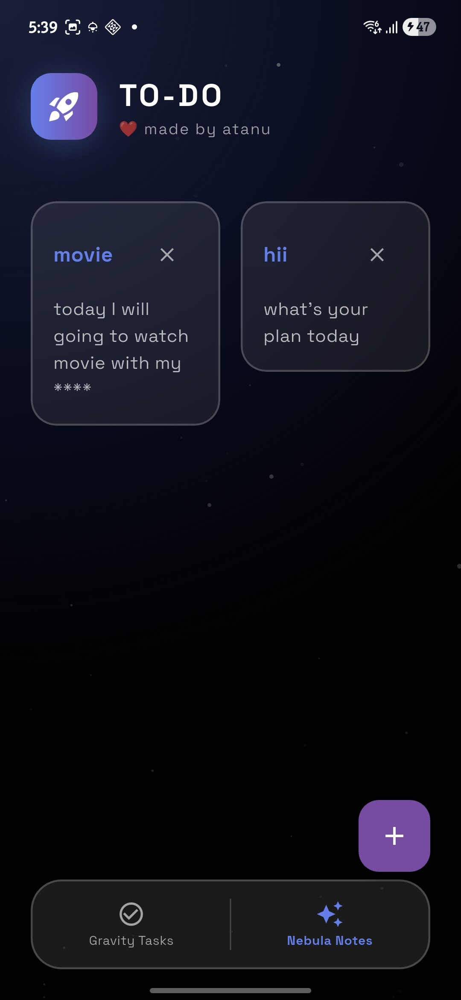

# 🚀 To-Do & Notes

> **"A productivity app that feels like zero-gravity."**

A modern, physics-based personal space built with **Flutter**. This project replaces the standard boring list view with a fluid interface where tasks fall, bounce, and float using simulated physics.

<div align="center">
  
  
  
  
</div>

## ✨ Features

### 🌌 Design
* **Physics-Based UI:** Tasks don't just appear; they "fall" into your list from the top of the screen and bounce using `flutter_animate`.
* **Glassmorphism:** A deep space visual theme featuring translucent cards, background blurs, and neon accents.
* **Floating Elements:** Interactive elements feel weightless and fluid.

### 📝 Dual-Mode Productivity
* **Gravity Tasks:** A dedicated space for your daily to-dos.
    * *Swipe-to-delete* with physics.
    * *Tap-to-complete* with instant feedback.
* **Nebula Notes:** A staggered (masonry) grid layout for capturing thoughts, ideas, and random notes.
    * Beautiful glass card layout.
    * Dynamic sizing based on content.

### 💾 Local Persistence
* **Offline First:** All data is saved locally on the device using `shared_preferences`.
* **Auto-Save:** Your tasks and notes reappear exactly where you left them (or fall in again) when you restart the app.

---

## 🛠️ Tech Stack & Dependencies

This project relies on the following open-source packages to create its unique look and feel:

* **[flutter_animate](https://pub.dev/packages/flutter_animate):** For the gravity, falling, and bouncing effects.
* **[flutter_staggered_grid_view](https://pub.dev/packages/flutter_staggered_grid_view):** For the masonry layout in the Notes section.
* **[google_fonts](https://pub.dev/packages/google_fonts):** Using 'Space Grotesk' for modern, futuristic typography.
* **[shared_preferences](https://pub.dev/packages/shared_preferences):** For saving data locally.
* **[uuid](https://pub.dev/packages/uuid):** For generating unique IDs for tasks and notes.

---

## 🚀 Getting Started

To run this project on your local machine:

1.  **Clone the repository:**
    ```bash
    git clone [https://github.com/atanupaul1/To-Do-App.git](https://github.com/atanupaul1/To-Do-App.git)
    cd To-Do-App
    ```

2.  **Install dependencies:**
    ```bash
    flutter pub get
    ```

3.  **Run the app:**
    ```bash
    flutter run
    ```
---

<div align="center">
  <sub>Made with ❤️ by Atanu using Flutter</sub>
</div>
